# 01-workstation-setup

## Tavoite

Tämän projektin tavoitteena oli toteuttaa Windows 11 Pro -työaseman perusasennus ja käyttöönotto helpdesk-näkökulmasta. Projekti kattaa työaseman asennuksen, peruskovennuksen, käyttäjähallinnan, jaetun resurssin, tulostuksen sekä yhden hallitun vikatilanteen ja sen ratkaisemisen.

## Ympäristö

Virtuaaliympäristö: VMware Workstation

Käyttöjärjestelmä: Windows 11 Pro

Verkko: NAT

Resurssit:
- CPU: 2 cores
- RAM: 8 GB
- Levytila: 70 GB

## Toteutus

### Windows 11 Pro -asennus

- Windows 11 Pro asennettu puhtaana asennuksena
- Tietokone nimetty muotoon `mire-pc`
- Paikallinen admin-käyttäjä luotu
- VMware Tools asennettu

### 2. Päivitykset ja ajurit

- Päivitykset ajettu loppuun
- Järjestelmä ajan tasalla
- Laitehallinta tarkistettu

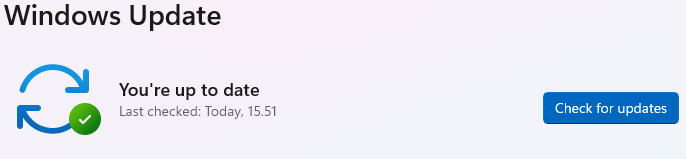

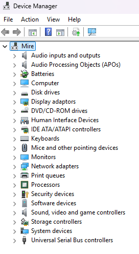

### 3. Peruskovennus

- Windows Defender (Real-time protection) käytössä
- Palomuuri käytössä kaikissa profiileissa
- BitLocker ei ollut käytettävissä tässä virtuaaliympäristössä (VMware / TPM-rajoite)

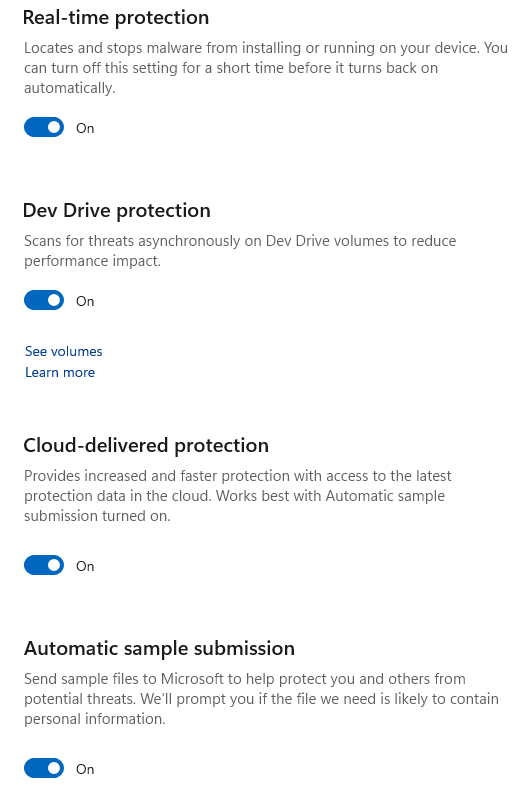
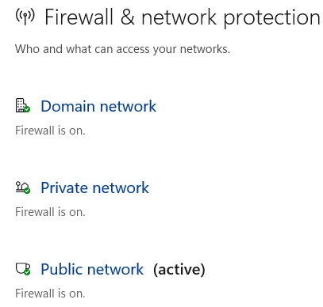
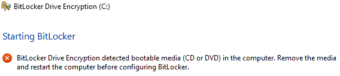

### 4. Käyttäjähallinta

- Käyttäjien luonti: Luotiin käyttäjät mire-user ja test-user.

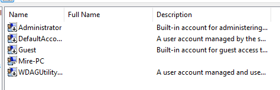
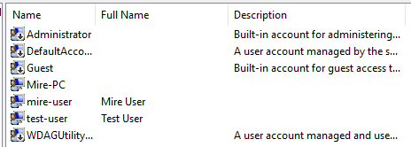

- Paikallinen ryhmä: Paikallinen ryhmä Helpdesk-Local luotu ja käyttäjät mire-user ja test-user lisätty ryhmään

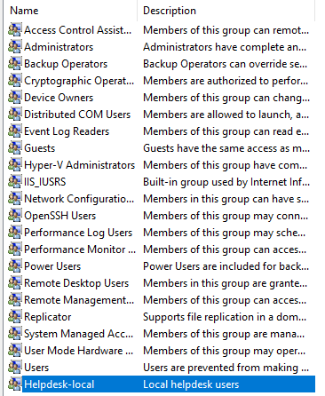
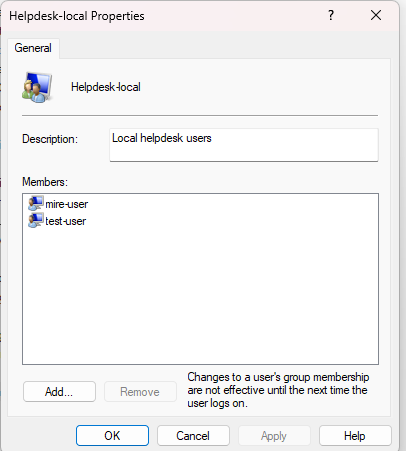

- Käyttöoikeuksien erottelu: Tarkistettiin member of sivulta oikeudet ja varmistettiin ettei käyttäjillä ollut admin oikeuksia.

  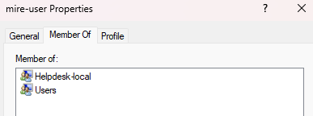
  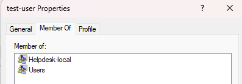

- Kirjautumistestaus: lopuksi testattiin kirjautumista.
  
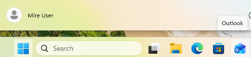
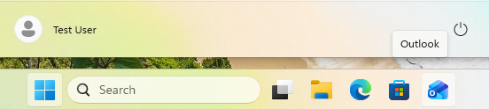

### 5. Jaettu kansio

Tässä vaiheessa toteutettiin jaetun kansion luonti ja käyttöoikeuksien määrittely helpdesk-näkökulmasta.

- Luotiin kansiorakenne C:\Support\PublicDocs

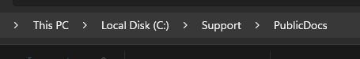

- Kansio jaettiin verkkoon nimellä PublicDocs

Share-oikeudet:

- Everyone: Read
- Helpdesk-Local: Change

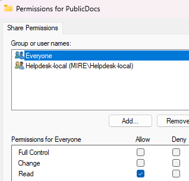
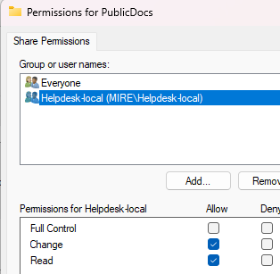

NTFS-oikeudet:

- Administrators: Full Control
- Helpdesk-Local: Modify
- Users: Read & Execute

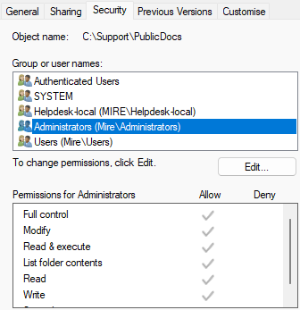
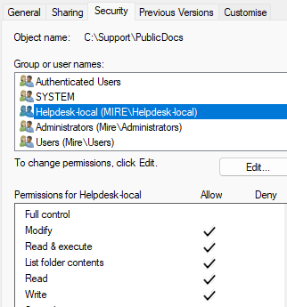
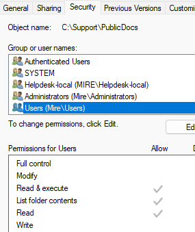

Testattiin että jaettu kansio toimii: Kirjauduttiin mire-user käyttäjälle ja tallennettiin tekstitiedosto jaettuun kansioon.

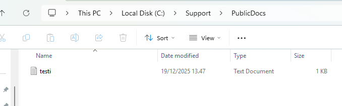

### 6. Tulostus(virtuaalinen)

- Tarkistettu, että Microsoft Print to PDF -tulostin on käytettävissä
- Suoritettu testitulostus Notepadista
- Tulostus tallennettu PDF-muotoon polkuun `C:\Support\test-print.pdf`

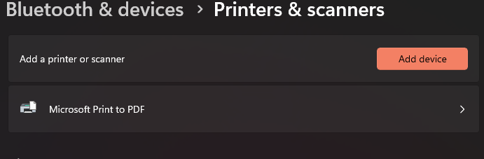
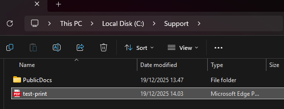

