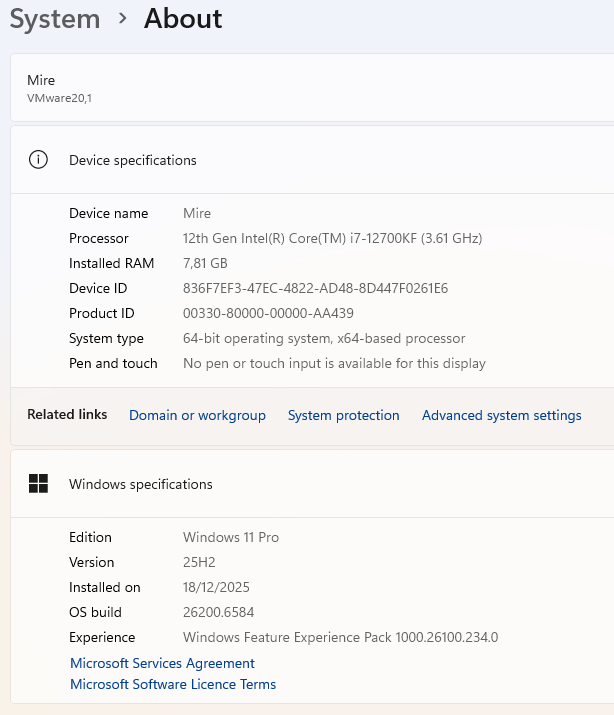
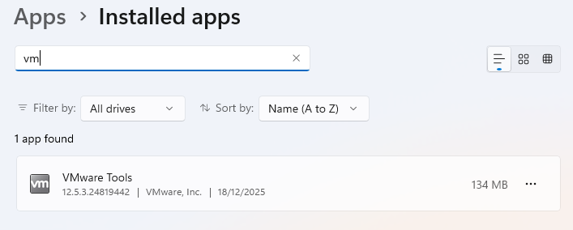

# 01-workstation-setup

## Tavoite

Tämän projektin tavoitteena oli toteuttaa Windows 11 Pro -työaseman perusasennus ja käyttöönotto helpdesk-näkökulmasta. Projekti kattaa työaseman asennuksen, peruskovennuksen, käyttäjähallinnan, jaetun resurssin, tulostuksen sekä yhden hallitun vikatilanteen ja sen ratkaisemisen.

## Ympäristö

Virtuaaliympäristö: VMware Workstation

Käyttöjärjestelmä: Windows 11 Pro

Verkko: NAT

CPU: 2 core

RAM: 7.8 GB

Levytila: 70GB

## Toteutus

### Windows 11 Pro -asennus

- Windows 11 Pro asennettu puhtaana asennuksena

- Paikallinen admin-käyttäjä luotu

- Tietokone nimetty uudelleen muotoon mire-pc

- VMware Tools asennettu

