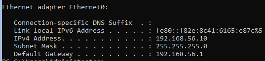
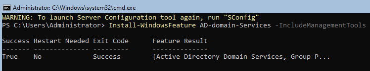
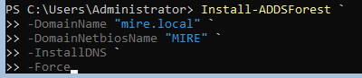
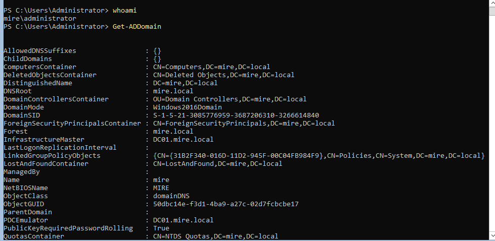

# 02-active-directory

## Tavoite

Tämän projektin tavoitteena on toteuttaa Active Directory -ympäristö helpdesk-näkökulmasta. Projekti kattaa Domain Controllerin käyttöönoton, perusrakenteen (OU), käyttäjä- ja ryhmähallinnan, työaseman liittämisen domainiin sekä tyypillisen helpdesk-vikatilanteen.

### Ympäristö:

Virtuaaliympäristö: VMware Workstation

Domain Controller: DC01

Käyttöjärjestelmä: Windows Server 2022 Server Core

Domain: mire.local

NetBIOS: MIRE

Verkko: Host-only

IP-osoite: Staattinen (DC01 osoittaa DNS:llä itseensä)

## 1. Domain Controllerin käyttöönotto

- Domain Controller toteutettiin Windows Server 2022 Server Core -versiolla käyttäen sconfig-työkalua ja PowerShelliä.

Toteutus:

- Palvelin nimettiin muotoon DC01
- Palvelimelle määritettiin staattinen IPv4-osoite
- DNS-palvelimeksi asetettiin palvelimen oma IP-osoite
- Active Directory Domain Services -rooli asennettiin PowerShellillä
- Luotiin uusi forest ja domain: mire.local
- Palvelin käynnistettiin uudelleen Domain Controlleriksi ylennyksen jälkeen
  
Domainin toiminta varmistettiin kirjautumalla domain-ympäristöön ja tarkistamalla domainin tiedot PowerShellillä.

