# 02 Active directory

#### Abdirahman Mire

## Tavoite

Tämän projektin tavoitteena on toteuttaa Active Directory -ympäristö helpdesk-näkökulmasta. Projekti kattaa Domain Controllerin käyttöönoton, perusrakenteen (OU), käyttäjä- ja ryhmähallinnan, työaseman liittämisen domainiin sekä tyypillisen helpdesk-vikatilanteen.

### Ympäristö:

- Virtuaaliympäristö: VMware Workstation
- Domain Controller: DC01
- Käyttöjärjestelmä: Windows Server 2022 Server Core
- Domain: mire.local
- NetBIOS: MIRE
- Verkko: Host-only
- IP-osoite: Staattinen (DC01 osoittaa DNS:llä itseensä)

## 1. Domain Controllerin käyttöönotto

- Palvelin nimettiin DC01 ja verkko määritettiin staattiseksi
- DNS-palvelimeksi asetettiin palvelimen oma IP-osoite
- Active Directory Domain Services- ja DNS-roolit asennettiin
- Luotiin uusi forest ja domain mire.local

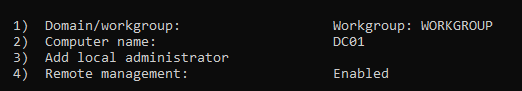 
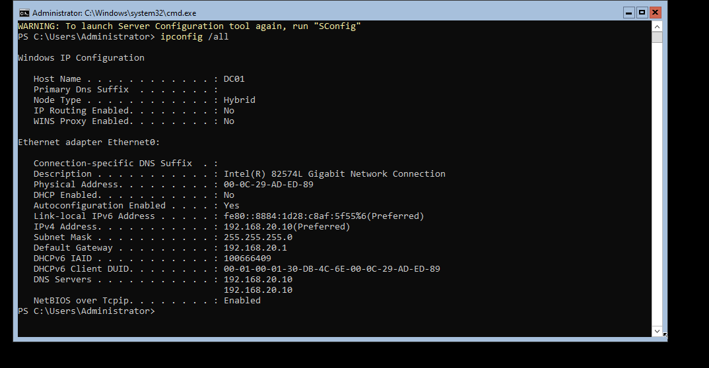
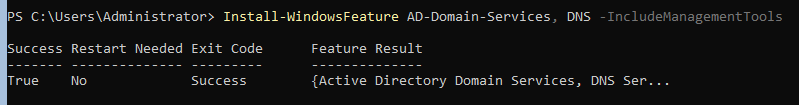
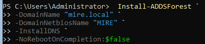
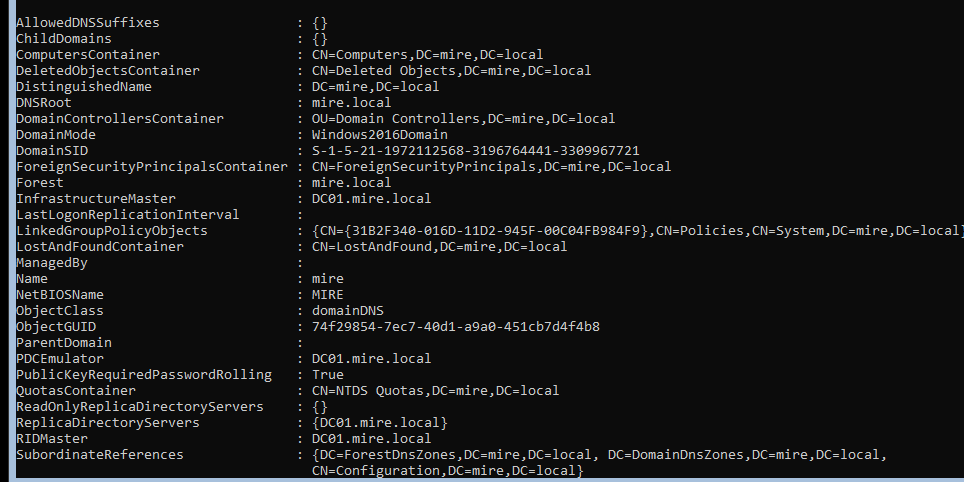 
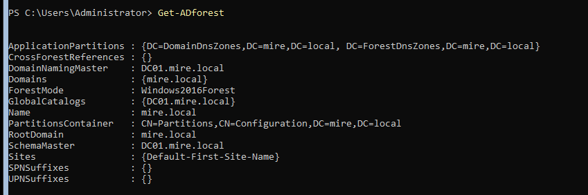

## 2. OU-rakenne(Organizational Units)

- Domainiin luotiin erilliset OU:t käyttäjille, ryhmille, työasemille ja IT-hallinnalle
- Rakenne mahdollistaa selkeän hallinnan ja myöhemmän ryhmäkäytäntöjen kohdistamisen
- OU:t luotiin PowerShellillä Domain Controllerilla

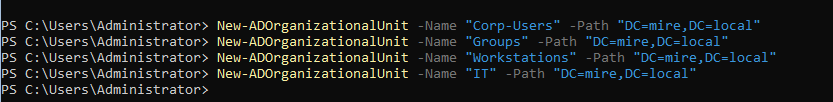
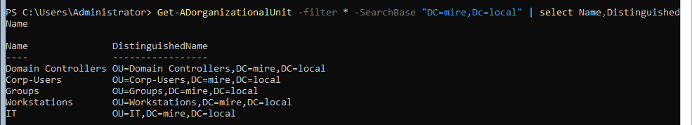

## 3. Käyttäjät ja ryhmät

- Luotiin domain-käyttäjät IT-hallintaa ja peruskäyttöä varten
- Luotiin globaalit turvaryhmät käyttöoikeuksien hallintaan
- Käyttäjät sijoitettiin OU:ihin (IT, Corp-Users) ja lisättiin ryhmiin

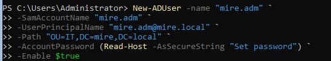
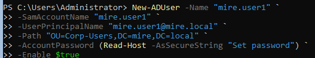
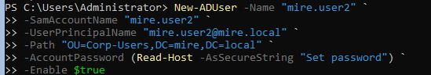
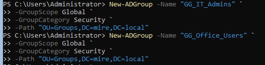
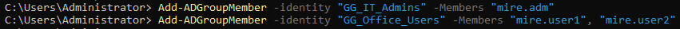 
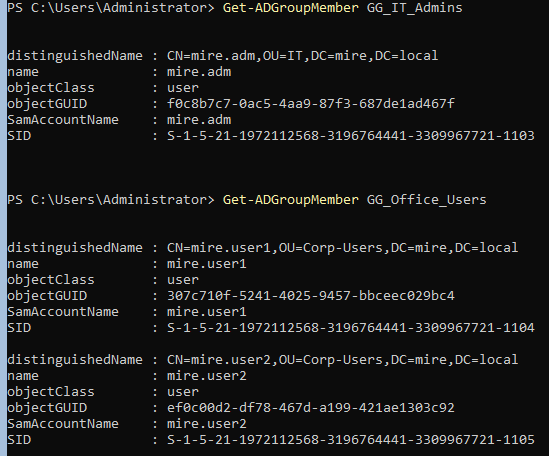

## 4. Työaseman liittäminen domainiin

- Windows 11 -työasema liitettiin domainiin `mire.local`
- Työasema konfiguroitiin käyttämään Domain Controlleria DNS-palvelimena
- Olemassa oleva tietokonetili hyödynnettiin domain joinissa
- Domain-käyttäjällä kirjautuminen testattiin onnistuneesti

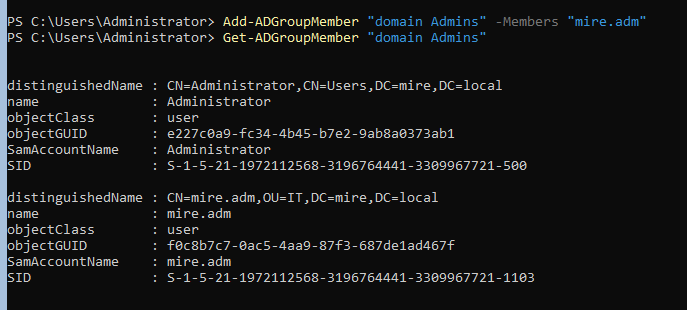
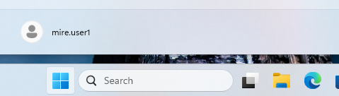
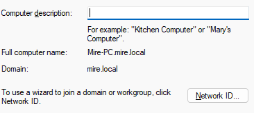
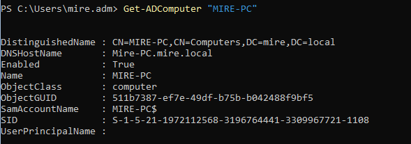 

## 5. Group Policy (GPO)

- Luotiin GPO GPO-Workstation-Restrictions
- GPO hallittiin RSAT-työkaluilla domainiin liitetyltä työasemalta
- Käytäntö estää Control Panelin ja PC-asetusten käytön peruskäyttäjiltä
- GPO linkitettiin käyttäjien OU:hun

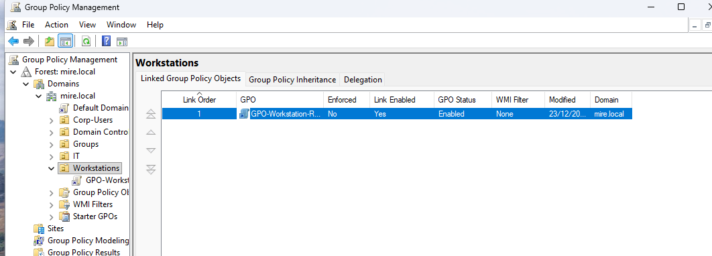
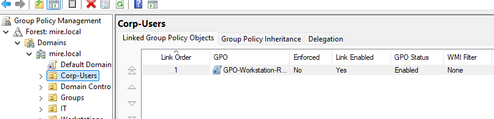
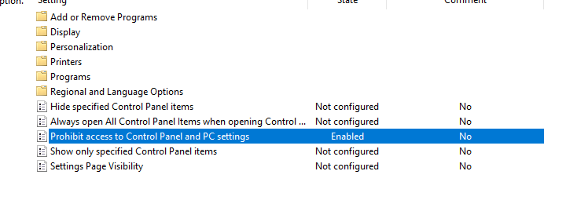
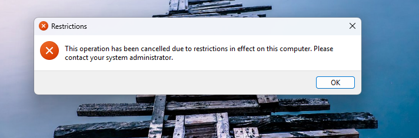

## 6. Helpdesk-case: käyttäjätilin lukitus (hallittu)

#### Tilanne:

- Käyttäjä ei pääse kirjautumaan domainiin. Kirjautumisyritys palauttaa virheilmoituksen, että käyttäjätili on lukittu.

#### Diagnoosi:
- Active Directoryn Account Lockout Policy lukitsi käyttäjätilin useiden epäonnistuneiden kirjautumisyritysten jälkeen.

#### Toimenpiteet:

- Domainiin määritettiin Account Lockout Policy lukituskynnyksellä
- Käyttäjätilin lukitustila varmistettiin Active Directory Users and Computers -konsolissa
- Lukitus vapautettiin poistamalla Unlock account -valinta
- Kirjautuminen testattiin uudelleen työasemalla

#### Lopputulos:
Käyttäjä pystyi kirjautumaan domainiin normaalisti lukituksen vapauttamisen jälkeen.

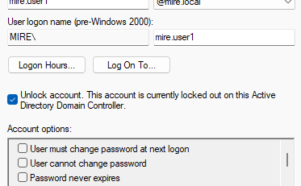
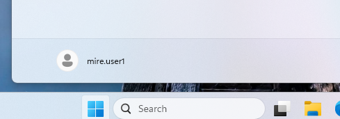

## Helpdesk-yhteys (Active Directory)

Tässä kokonaisuudessa toteutettiin Active Directory -ympäristö helpdesk-näkökulmasta. Työ kattoi Domain Controllerin käyttöönoton, OU-rakenteen, käyttäjä- ja ryhmähallinnan, työaseman liittämisen domainiin sekä Group Policy -hallinnan RSAT-työkaluilla. Lisäksi simuloitiin hallittu helpdesk-case, jossa käyttäjän kirjautumisongelma johtui lukittuneesta käyttäjätilistä ja ratkaistiin Active Directoryn avulla.

