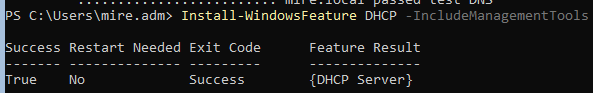
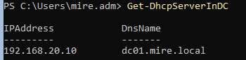
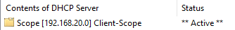
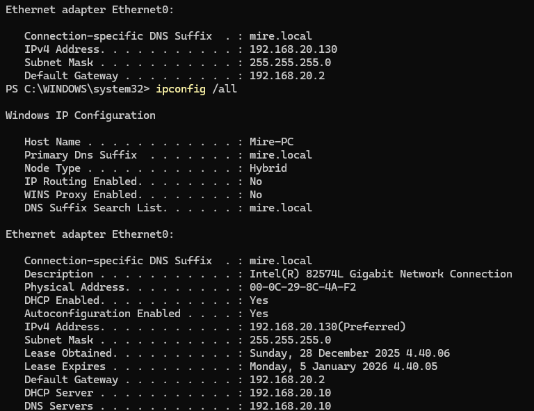

# 03 DNS & DHCP – Network Troubleshooting

### Abdirahman Mire

## Yleiskuvaus

Tässä projektissa toteutetaan ja vianmäärityksen kautta validoidaan Windows-ympäristön perusverkkopalvelut (DNS ja DHCP). Projekti on rakennettu helpdesk-näkökulmasta ja keskittyy yleiseen domain-ympäristön ongelmaan: työasema ei pysty resolvoimaan domain-resursseja väärän DNS-konfiguraation vuoksi.

Projekti sisältää suunnitellun virhetilanteen, jossa domain-resoluutio epäonnistuu väärän DNS-asetuksen vuoksi, sekä sen systemaattisen vianmäärityksen, korjauksen ja testauksen.

## Ympäristö

### Virtuaaliympäristö: VMware Workstation (NAT)
- Domain Controller: Windows Server 2022 Server Core
- Hostname: DC01
- Roolit: AD DS, DNS, DHCP
- Domain: mire.local
- DNS: AD-integroitu
  
### Client-työasema:

- Windows 11 Pro (Mire-PC)
- RSAT asennettu
- Verkko: IPv4 / DHCP

## Projektin tavoite

- Toteuttaa toimiva DNS- ja DHCP-ympäristö Active Directory -domainissa
- Varmistaa, että työasema saa oikeat verkkoasetukset DHCP:ltä
- Todentaa dynaaminen DNS-rekisteröityminen
- Simuloida ja ratkaista yleinen helpdesk-tason verkko-ongelma
- Dokumentoida koko prosessi selkeästi ja toistettavasti

### 1. DNS-palvelun konfigurointi

DNS-palvelu on asennettu osana Active Directory Domain Services -roolia domain controllerilla (DC01). Tässä vaiheessa varmistettiin DNS-palvelun perustoiminta sekä valmius domain- ja internet-nimien resoluutioon helpdesk-ympäristössä.

- DNS Forwarders määritettiin mahdollistamaan internet-nimien resoluutio domainin ulkopuolelle
- AD-integroitu DNS-zone `mire.local` tarkistettiin
- Domain controllerin nimipalvelutietueiden olemassaolo varmistettiin

DNS-palvelun toiminta validoitiin komentorivityökaluilla sekä domainin sisäisten että internet-osoitteiden osalta.

**Validointi**
- Domain-nimen resoluutio: `nslookup dc01.mire.local`
- Internet-nimen resoluutio: `nslookup www.microsoft.com`
- DNS-diagnostiikka: `dcdiag /test:dns`

DNS todettiin toimivaksi ja valmiiksi DHCP-integraatiota sekä client-työasemien nimiresoluutiota varten.

### 2. DHCP-palvelun käyttöönotto

- DHCP-palvelu asennettiin ja autorisoitiin domain controllerille (DC01). Palvelun avulla domain-työasemat saavat automaattisesti IP-osoitteet ja tarvittavat verkkoasetukset.
- IPv4-scope luotiin verkkoon 192.168.20.0/24 ja domain controllerin IP-osoite poissuljettiin jaettavasta alueesta. Scope aktivoitiin ja konfiguroitiin domain-ympäristöä varten.

Scope Options:

- 003 Router: 192.168.20.2
- 006 DNS Servers: 192.168.20.10
- 015 DNS Domain Name: mire.local

DHCP-toiminta validoitiin client-työasemalla, joka sai IP-osoitteen DHCP:ltä ja käytti domain controlleria nimipalvelimena.

Validointi: `ipconfig /all`

