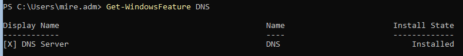
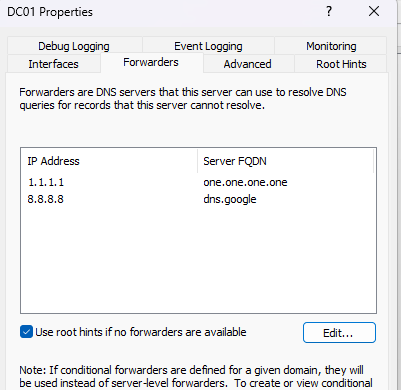
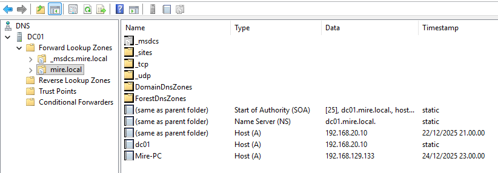
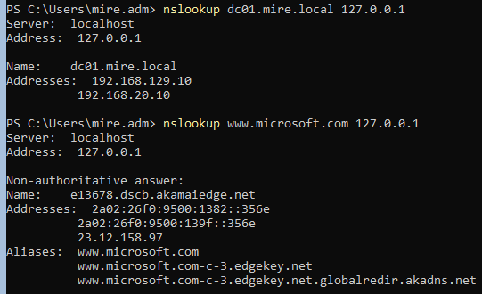
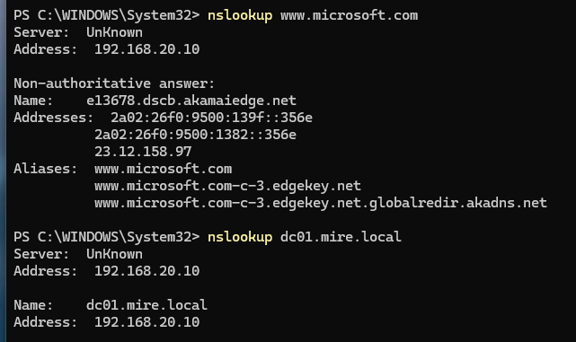
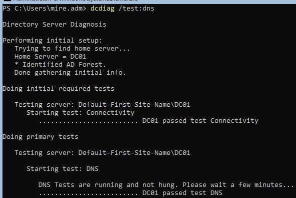

# 03 DNS & DHCP

### Abdirahman Mire

## Yleiskuvaus

Tässä projektissa toteutetaan ja vianmäärityksen kautta validoidaan Windows-ympäristön perusverkkopalvelut (DNS ja DHCP). Projekti on rakennettu helpdesk-näkökulmasta ja keskittyy yleiseen domain-ympäristön ongelmaan: työasema ei pysty resolvoimaan domain-resursseja väärän DNS-konfiguraation vuoksi.

Projekti sisältää suunnitellun virhetilanteen, systemaattisen vianmäärityksen sekä korjauksen ja testauksen.

## Ympäristö

### Virtuaaliympäristö: VMware Workstation (NAT)
- Domain Controller: Windows Server 2022 Server Core
- Hostname: DC01
- Roolit: AD DS, DNS, DHCP
- Domain: mire.local

### Client-työasema:

- Windows 11 Pro (Mire-PC)
- RSAT asennettu
- Verkko: IPv4 / DHCP

## Projektin tavoite

- Toteuttaa toimiva DNS- ja DHCP-ympäristö Active Directory -domainissa
- Varmistaa, että työasema saa oikeat verkkoasetukset DHCP:ltä
- Todentaa dynaaminen DNS-rekisteröityminen
- Simuloida ja ratkaista yleinen helpdesk-tason verkko-ongelma
- Dokumentoida koko prosessi selkeästi ja toistettavasti

### 1. DNS-palvelun konfigurointi

DNS-palvelu on asennettu osana Active Directory Domain Services -roolia domain controllerilla (DC01). Tässä vaiheessa DNS:n perustoiminta varmistettiin ja konfiguroitiin toimimaan helpdesk-ympäristölle tyypillisellä tavalla.
DNS Forwarders määritettiin mahdollistamaan internet-nimien resoluutio domain-ympäristössä. Domainin AD-integroitu DNS-zone (`mire.local`) tarkistettiin ja varmistettiin, että domain controllerin nimipalvelutietueet ovat olemassa.
DNS-palvelun toiminta validoitiin komentorivityökaluilla sekä domainin sisäisten että internet-osoitteiden osalta.

**Validointi**
- Domain-nimen resoluutio: `nslookup dc01.mire.local`
- Internet-nimen resoluutio: `nslookup www.microsoft.com`
- DNS-diagnostiikka: `dcdiag /test:dns`

DNS todettiin toimivaksi ja valmiiksi DHCP-integraatiota sekä client-työasemien nimiresoluutiota varten.

