# 04 File Services – NTFS & Share Permissions
### Abdirahman Mire

## Yleiskuvaus
Tässä projektissa toteutetaan File Services -kokonaisuus Active Directory -ympäristössä helpdesk-näkökulmasta. Projekti keskittyy SMB-jaon luontiin sekä NTFS- ja Share-oikeuksien hallintaan ryhmäpohjaisesti Server Core -ympäristössä.

Tavoitteena on rakentaa selkeä ja tuotantoympäristöä vastaava käyttöoikeusmalli, jossa jaon näkyvyys ja varsinaiset käyttöoikeudet on erotettu toisistaan.

## Ympäristö
- Domain Controller / File Server: DC01  
- Käyttöjärjestelmä: Windows Server 2022 Server Core  
- Domain: mire.local  
- Client-työasema: Windows 11 Pro (domainiin liitetty)  
- Hallinta: RSAT (client-työasemalta)  
- Verkko: IPv4 / DHCP  

---

## Projektin tavoite
- Toteuttaa SMB-tiedostojako domain-ympäristössä  
- Hallita käyttöoikeudet ryhmäpohjaisesti (ei käyttäjäkohtaisia oikeuksia)  
- Erotella Share- ja NTFS-oikeuksien vastuut  
- Rakentaa pohja tyypilliselle käyttöoikeuksiin liittyvälle helpdesk-caselle  

## 1. SMB-jaon luonti
Domain controllerille luotiin jaettava resurssi osastokohtaista tiedostojen hallintaa varten.

Kansio jaettiin verkkoon SMB-jakona nimellä **Departments**.  
Jaon toiminta validoitiin sekä palvelimella että domainiin liitetyllä työasemalla.

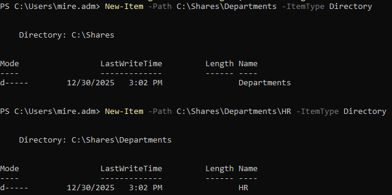  
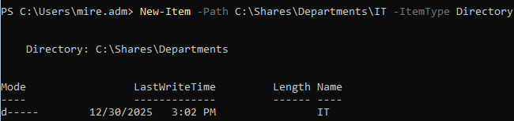  

## 2. Ryhmät ja käyttöoikeusmalli
Käyttöoikeudet toteutettiin ryhmäpohjaisesti Active Directory -ryhmiä hyödyntäen.

Luodut ryhmät:
- HR_RW  
- IT_RW  

Oikeudet myönnetään ainoastaan ryhmille, ei yksittäisille käyttäjille.

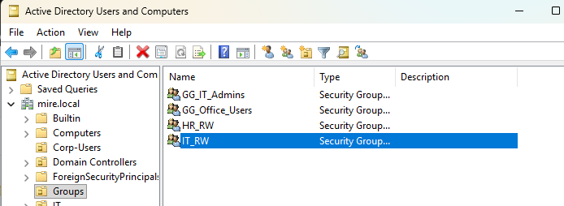

## 3. Share-oikeudet
Share-oikeudet pidettiin yksinkertaisina ja niitä käytettiin vain jaon yleiseen näkyvyyteen.

- Authenticated Users: Read  
- Administrators: Full Control  

Varsinainen käyttöoikeuksien hallinta toteutettiin NTFS-oikeuksilla.

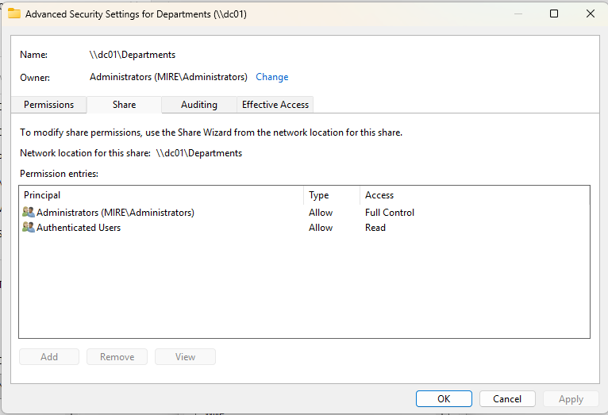

## 4. NTFS-oikeudet
NTFS-oikeudet määritettiin osastokohtaisiin alikansioihin.

**Departments (juurikansio):**
- Periytyvät oikeudet pidettiin käytössä näkyvyyttä varten  

**HR-kansio:**
- HR_RW: Modify  
- Administrators: Full Control  
- SYSTEM: Full Control  

**IT-kansio:**
- IT_RW: Modify  
- Administrators: Full Control  
- SYSTEM: Full Control  

NTFS-oikeudet määritettiin domainiin liitetyltä työasemalta RSAT-työkaluilla, koska tiedostopalvelin toimii Server Core -ympäristössä ilman graafista käyttöliittymää.

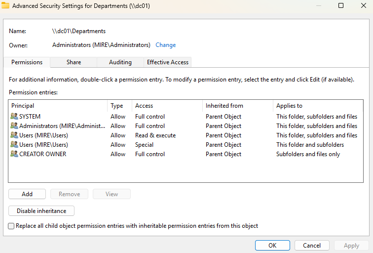  
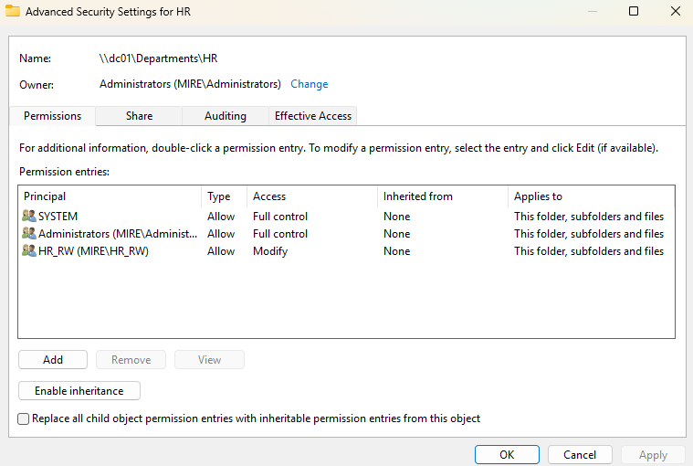  
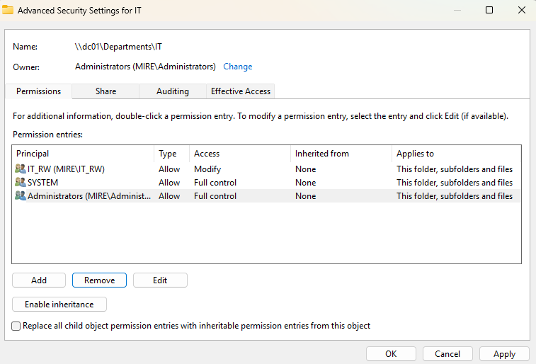

## Helpdesk-case: Access Denied osastokansioon

### Ongelma
Domain-käyttäjä ei pääse avaamaan HR-osaston kansiota SMB-jaossa, vaikka jaon näkyvyys toimii.

Virheilmoitus:
> Windows cannot access \\dc01\Departments\HR  
> You do not have permission to access this resource.

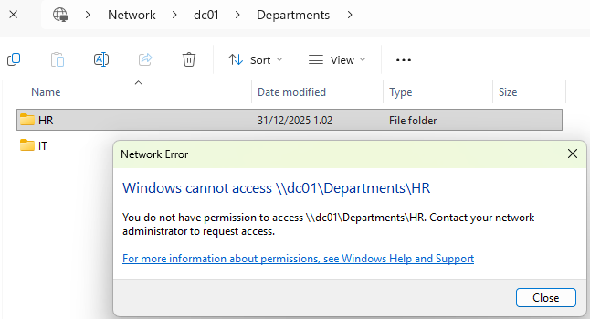

### Vianmääritys
1. Tarkistettiin käyttäjän ryhmäjäsenyydet Active Directoryssa  
   - Käyttäjä **ei ollut** HR_RW-ryhmässä
2. Vahvistettiin, että NTFS-oikeudet HR-kansiossa ovat oikein (HR_RW = Modify)

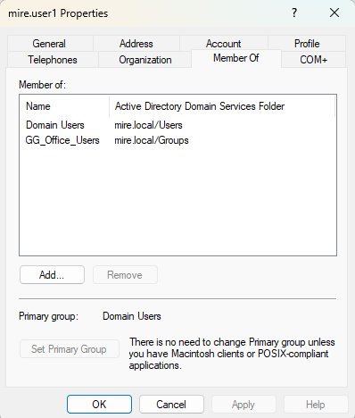

### Korjaustoimenpide
- Käyttäjä lisättiin ryhmään **HR_RW**
- Käyttäjä kirjautui uudelleen sisään (uusi token)

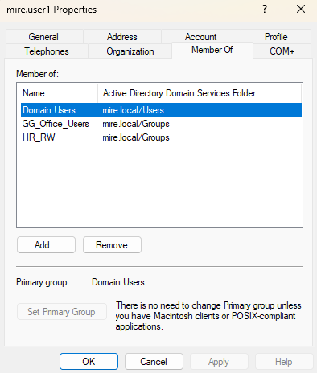

### Lopputulos
- Käyttäjä pääsee HR-kansioon
- Tiedostojen luonti ja muokkaus onnistuu
- Ei muutoksia Share- tai NTFS-oikeuksiin

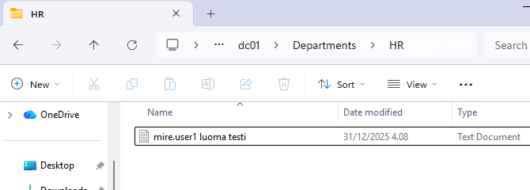

### Johtopäätös
Ongelma johtui puuttuvasta ryhmäjäsenyydestä, ei virheellisistä NTFS- tai Share-oikeuksista.  
Ratkaisu toteutettiin ryhmäpohjaisesti ilman käyttäjäkohtaisia oikeuksia.

